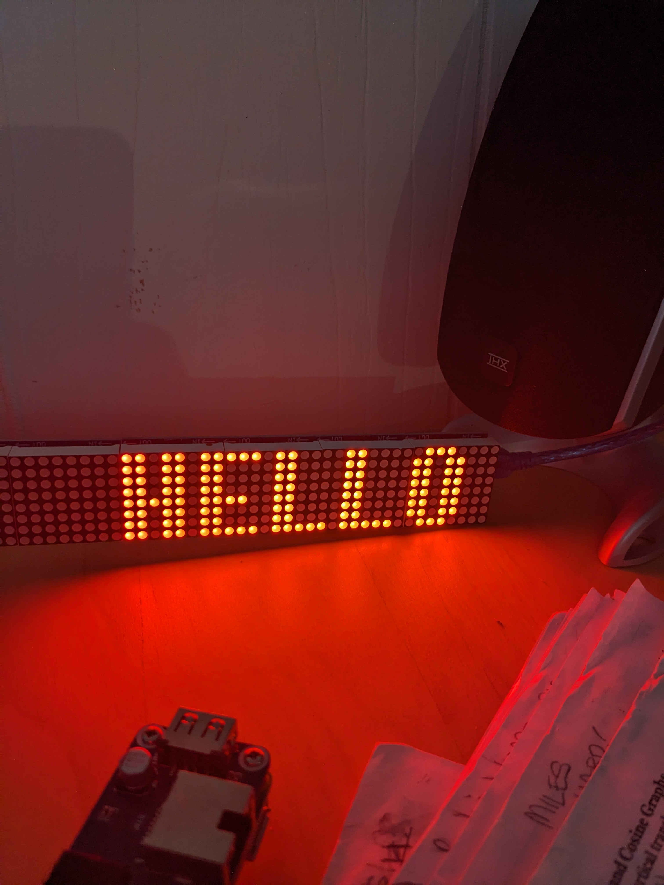

MAX7219 Font Generator for Arduino/ ESP boards (.h output)
---

Uses Python/ Pillow to render .otf fonts and output C++ headers

Usage: python3 main.py -o <input font> -e <output header file> -n 

Example:
    python3 main.py -o fonts/eight-bit-dragon.otf -e fonts_h/eight_bit.h -n eight_bit_font

The font.h files contain two arrays for the font: 

    data array - stores the pixel data for each character
    offset array - stores the starting index of each character in the data array
    
    To find the width of character 'c':
        int width = font_name_offsets[c - start_char + 1] - font_name_offsets[c - start_char];

here is a preview of the 8 bit font shown:

